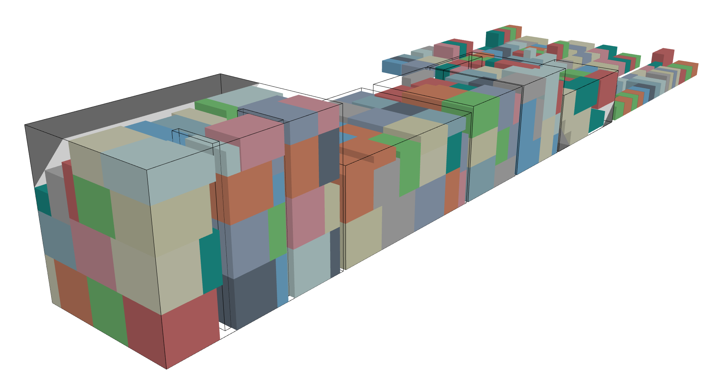

# SardineCan 

SardineCan is a humble 3D knapsack / bin packing solver with some special
constraints. It is a collection of constructive heuristics, meta-heuristic
attempts and linear models with CPLEX & Gurobi bindings.



## Outline

- [SC.Service](SC.Service/)
  - Jobmanager/runner as a RESTful service for integration with other applications
- [SC.GUI](SC.GUI/)
  - GUI for experimenting with the algorithms and rendering instances
- [SC.CLI](SC.CLI/)
  - Command-line interface with a JSON-in/JSON-out style

## Quickstart

Spin it up (requires [docker](https://docs.docker.com/get-docker/)):

```bash
docker run -d --restart always -p 4550:80 --name sardinecan ghcr.io/merschformann/sardinecan:latest
```

Swagger UI description of the RESTful service can be found here (or at the port
of your choice): [http://localhost:4550/swagger](http://localhost:4550/swagger)

## Remarks

The code mainly derives from my (Marius Merschformann) master thesis (2014) and
was primarily uploaded to enable colleagues to use it for their projects.
However, it would be great, if it is useful to even more people. :)

### Gurobi & CPLEX support

Unfortunately, I cannot ship the Gurobi and CPLEX libraries with the code.
I made an attempt of not relying on these during compile time by moving them to
a Nuget package (Atto.LinearWrap). Even though this part works, I had some
issues when supplying the dlls later on. Let me know, if you have ideas how to
overcome this.

I hope I can provide a solution for all who have access to Gurobi and/or CPLEX
in the future, so that the model formulations can also be tested.

### Contributors

The code mainly originated from the master-thesis of Marius Merschformann
(2014). Find a copy [here](./Material/MasterThesis/MasterThesis_MariusMerschformann.pdf).

The implementations around pre-processing were done by Daniel Erdmann and Simon
Moss during a university project. Further work on ALNS & some further extensions
were done in collaboration with Daniela Guericke.
